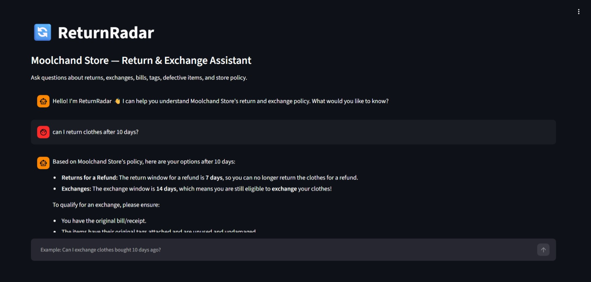

# 🔄 ReturnRadar — AI Return & Exchange Policy Assistant

ReturnRadar is a conversational AI application that answers customer questions about a store's return and exchange policy in natural language. Built with **Google ADK**, **Gemini**, and **Streamlit**, containerized with **Docker**, and deployed as a serverless service on **Google Cloud Run**.

**Live App:** [(https://return-radar-957182578820.asia-south1.run.app/)]

## 📸 Application Preview




## Problem

Customers often ask specific, repetitive questions about return/exchange rules — return window, receipt requirements, tag conditions, defective-item exceptions — instead of reading a full policy document. This creates repetitive support load, slow responses, and inconsistent answers when different staff explain the policy differently.

## Solution

ReturnRadar lets customers ask questions in plain language and returns an answer grounded in the store's actual policy data — not an invented or generic AI answer. A Google ADK `LlmAgent` calls a custom tool, `get_return_policy()`, which reads structured policy data from `policy.json`; Gemini then generates the response strictly from that retrieved data, with explicit instructions to never invent a rule.

## Architecture

```
User → Streamlit Chat UI (app.py) → Google ADK Runner → LlmAgent (agent.py)
     → get_return_policy() tool → policy.json → Gemini → Grounded Answer
```

## Tech Stack

| Layer | Technology |
|---|---|
| Frontend | Streamlit |
| AI Agent Framework | Google Agent Development Kit (ADK) |
| Language Model | Google Gemini |
| Policy Data | Structured JSON |
| Containerization | Docker |
| Deployment | Google Cloud Run + Cloud Build + Artifact Registry |
| Language | Python |

## Key Features

- Natural-language chat interface for return/exchange queries
- Policy-grounded responses — the agent is instructed to answer only from retrieved data, never invent rules
- Custom ADK tool (`get_return_policy()`) connecting the agent to structured policy data
- Persistent chat session per user via UUID-based session IDs
- Fully containerized and deployed as a public, serverless Cloud Run service

## Project Structure

```
ReturnRadar-AI-Agent/
├── agent.py          # ADK LlmAgent + policy-lookup tool
├── app.py            # Streamlit chat interface
├── policy.json        # Store return/exchange policy data
├── requirements.txt
├── Dockerfile
└── README.md
```

## What I Learned
Building and deploying ReturnRadar gave me hands-on experience across the full stack of a modern AI application: defining an agent and tool with Google ADK, grounding LLM responses in structured data rather than letting the model improvise, building a chat interface with Streamlit, containerizing a Python app with Docker, and deploying + debugging on Google Cloud Run (including diagnosing a Cloud Build permissions failure and a missing API key at runtime).

## Current Scope & Future Work
The current version retrieves policy data from a single local JSON file via direct tool lookup — it does not use vector embeddings or semantic search. Planned improvements: multi-store policy support, PDF/document ingestion, semantic retrieval over larger policy sets, conversation history, and authentication.

## Author

**Ankita Bodhankar** 
